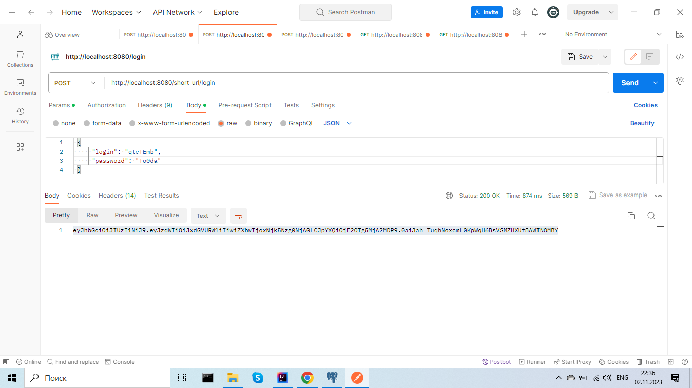
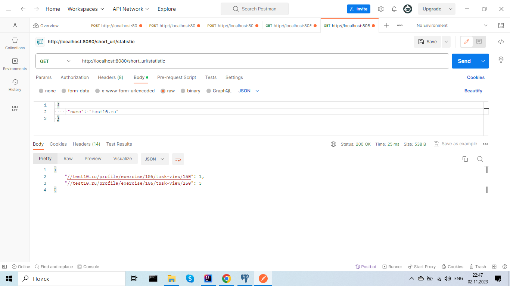

## Url_Short_Cut

### О проекте

----

Проект построенный на REST архитектуре web-приложений, представляющий собой
сервис для перенаправления клиентов на различные сайты через короткую строку.

### Описание фунционала

----

**Регистрация сайта.**
   
Для регистрации сайта на сервисе нужно отпрвить запрос *POST /registration* 
с телом JSON объекта

Флаг registration указывает, что регистрация выполнена или нет, то есть сайт уже есть в системе.

---

**Авторизация.**

Пользователь отправляет POST запрос с login и password и получает ключ. 
Этот ключ отправляет в запросе в блоке HEAD. 

----

**Регистрация URL.**

Поле того, как пользователь зарегистрировал свой сайт он может отправлять на сайт 
ссылки и получать преобразованные ссылки. Данная операция доступна только
авторизированным пользователям, т.е. нужно отправить токен в блоке HEAD.

---

**Переадресация.**

Любой пользователь может перейти по короткой ссылке через сервис.
*GET /redirect/УНИКАЛЬНЫЙ_КОД*

---

**Статистика.**

По сайту можно получить статистку всех адресов и количество вызовов этого адреса.
